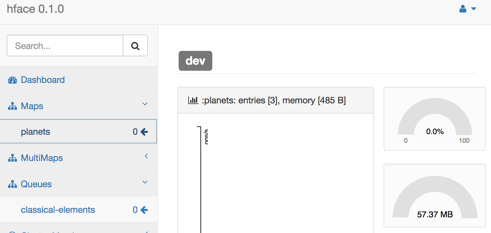

# hface server

sample Hazecast server with an [hface-client](https://github.com/tolitius/hface) dependency

## running sample

* run a [NodeStarter](src/main/java/org/hface/NodeStarter.java)
* connect to it from [hface](https://github.com/tolitius/hface): `java -jar -Dconf=/opt/app/hface/hface.conf target/hface-dash.jar`
* open http://localhost:3000/ in a web browser:

